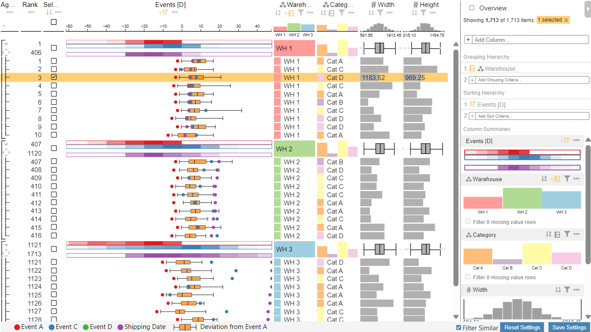

# Event Table Viewer Power BI Visual

Event Table Viewer is a visualization for analyzing event data along with categorical and numerical data columns in a tabular layout.

The custom Visual for Power BI uses an extended version of [LineUp.js](https://lineup.js.org/).
The extended version including the added event column is avaiable [here](https://github.com/jzethofer/lineupjs/tree/build) as a fork of [LineUp](https://github.com/lineupjs/lineupjs).

More information about the visual can be found under [Visual Setup](visual_setup.md) and [User Guide](user_guide.md).

## Key Features

### Data Table

Display categorical, numerical, or temporal data in a tabular layout

### Event data column

Show events for each data row on a shared and interactive time scale

Event types legend

Box plot: Visualize the spread of a future event based on similar observed data

Events in LineUp overview mode: tiny rectangles provide a compact view of events

Event reference column for comparing events that occured at different points in time

Heatmap summary visualization to compare distribution of events

Tooltips showing exact time scale values of events and box plot

### Visualization customization during analysis in Power BI reading mode

-   Sorting by events, box plot values, and data columns
-   Changing color mappings
-   Toggle which events and box plot values are displayed in normal and overview mode
-   Setting reference events for time scale and box plot
-   Group by one or multiple data columns
-   Filter by data columns
-   Change visual representations of cells and column summaries

### Filtering other visuals based on similar data IDs of selected rows

This allows to view data details behind the boxplot data.
