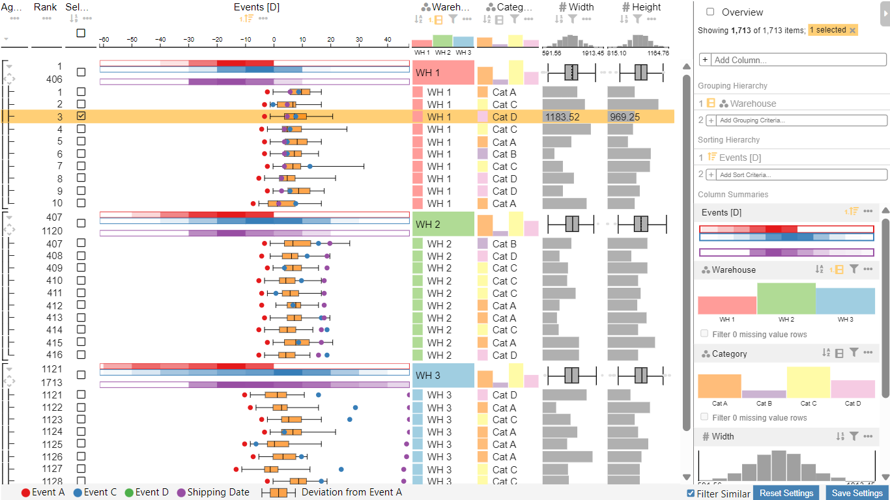

# Support

General information about the event table viewer can be found [here](index.md). 

For setup and usage see [Visual Setup](visual_setup.md) and [User Guide](user_guide.md).

If you encounter any bugs or issues, please open an issue on the [GitHub repository](https://github.com/jku-vds-lab/pro2future-event-table-viewer/issues).

You can also send an email to [admin@pro2future.at](mailto:admin@pro2future.at) for support.

