# User Guide

This page provides a detailed guide on how to use the Event Table Viewer Power BI visual.

The visual is based on an extended version of the LineUp.js library. There are two papers and corresponding videos that provide an overview of the library and its features available here: [https://jku-vds-lab.at/tools/lineup/](https://jku-vds-lab.at/tools/lineup/). The videos are from 2013 and 2017 and show older versions of the library. The event column feature is an extension and not part of the original library.

## Overview

This section gives an overview on the different visualization parts.

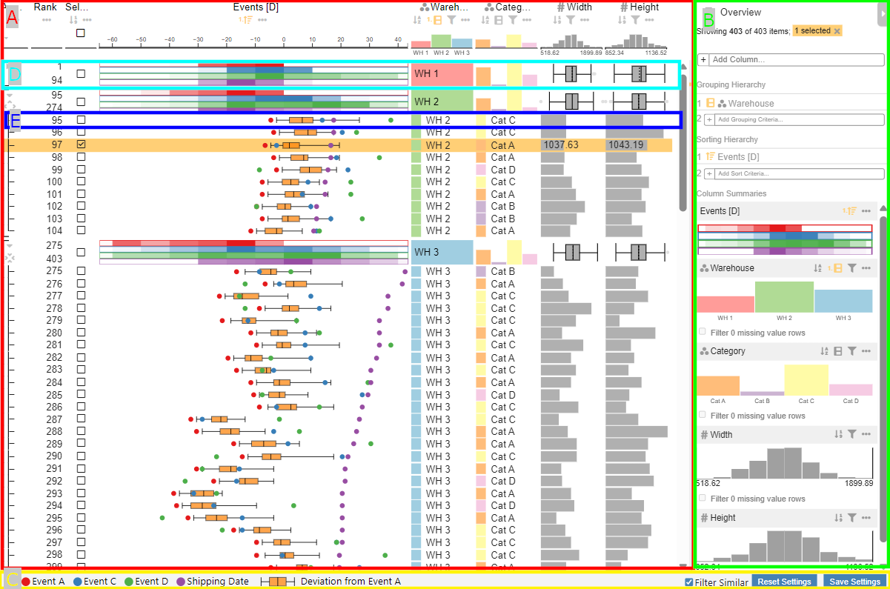

The visualization consists of the 3 main parts Table View, Data selection panel, and Visual Footer.

The Table View displays the data in a tabular layout and consists of the column headers at the top, Group summaries when the data is aggregated and Data Rows showing the individual data entries.

The Data selection panel allows add new columns, hierarchally group the data and sort rows and groups. It also contains an overview of each column's data distribution that can be used for filtering.

The Visual Footer contains the event column legend and has controls for changing the visual filter mode for Power BI and saving the visual state.

### Column Header

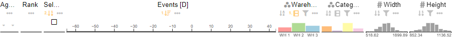

The column headers at the top of the table view display the column title and feature controls for sorting, filtering and other column settings. The bottom part of the header shows the data distribution of the column. The distribution visualization can be changed in the column settings.

The first three columns are special columns and have additional features. The aggregation column indicates that rows belong to a group. In its header, all groups of one level can be expanded or collapsed.

The column `Rank` displays the rank of the row in the current sorting order.

The selection column allows to select rows or groups. It can also be used to sort, filter, or group by the selection and to invert the selection.

### Group Summary

The group summary is displayed for aggregated data, when the aggregation strategy in the Power BI visual settings is set to `group`, `groupItem`, `groupTopItem`, or `groupItemTop`. It shows a summary for each group and can be expanded or collapsed to show the individual data rows.

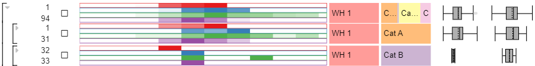

The image shows 3 different group summaries. The visualization was grouped by `Warehouse` first and then by `Category`. The first row shows the group summary for all warehouses `WH 1` which is indicated by the black bracket on the left. The second and third rows show the group summary for the categories `Cat A` and `Cat B` within the group `WH 1`. As indicated by the smaller brackets on the left, the categories are collapsed. The summary visualization for `Category` shows that `WH 1` consists of few rows from `Cat B` which can also be seen in the ranking numbers.

The summary visualization type can be changed individually for each column in the column settings.

### Data Rows

Each data row represents one data entry. The visualization of a cell depends on the column type and can be changed in the column settings. For example events are displayed as colored circles, while numerical values can be displayed as bar, brightness, dot, symbol size, string, or tick.

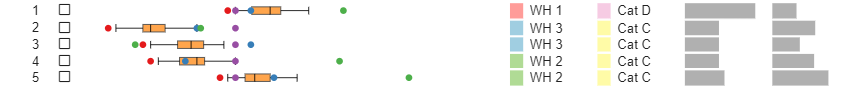

In this example image, there are five rows with different data entries. The event column shows that they their shipping date (violet) is around the same time, while the other events deviate. The categories are displayed as text and color.

### Data Selection Panel

The data selection panel gives an overview on the current visualization state.

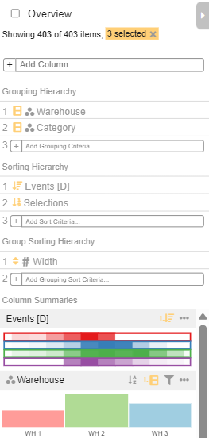

At the top of the panel, the overview mode can be toggled to show a compact view of the data. The next line shows how many data points are currently visible due to filtering, how many are available in total, and how many are selected.

### Visual Footer

The visual footer contains the event column legend. The legend text can be changed by renaming the Power BI column.

The `Filter Similar` checkbox is used to filter the data based on the provided IDs in the input field `Similar Data IDs` when active. Otherwise the visual will filter the data based on the selected rows.

The `Save Settings` button saves the current visual state as a JSON dump to the visual settings. This is only possible when the Power BI report is in edit mode. `Reset Settings` deletes the saved dump and resets the visual to its default state. This looses all color mappings, sorting, grouping, filtering, and visual representation settings.

## Grouping

Rows can be grouped by one or multiple columns. To group by categorical columns, click on the grouping icon in the column header. Then the grouping is displayed under `Grouping Hierachy` in the data selection panel. The hierachy order can be changed by hovering over one of the columns and clicking on the arrow symbol. A new grouping column can be added by clicking on the `+` symbol.

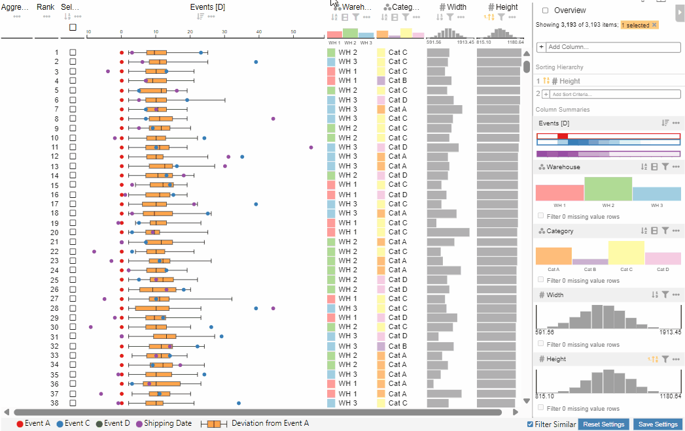

To explore the groups and data entries, the groups can be expanded or collapsed by clicking on the icons in the `Aggregate Groups` column on the left. In the header of the aggregation column, all groups of one level can be expanded or collapsed.

Numerical columns can be grouped by into a number of bins or into to groups split at a certain value. This grouping can be enabled in the column settings.

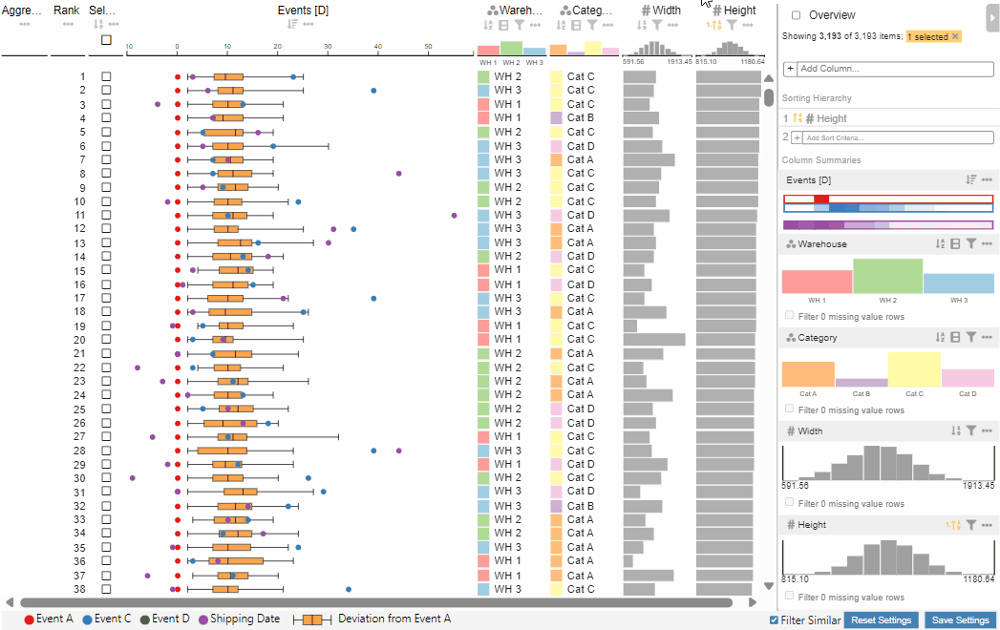

## Sorting

Columns can be sorted by clicking on the sorting icon in the column header. The sorting direction is indicated by the arrow next to the sorting icon. By clicking on the icon again the sorting direction can be changed.

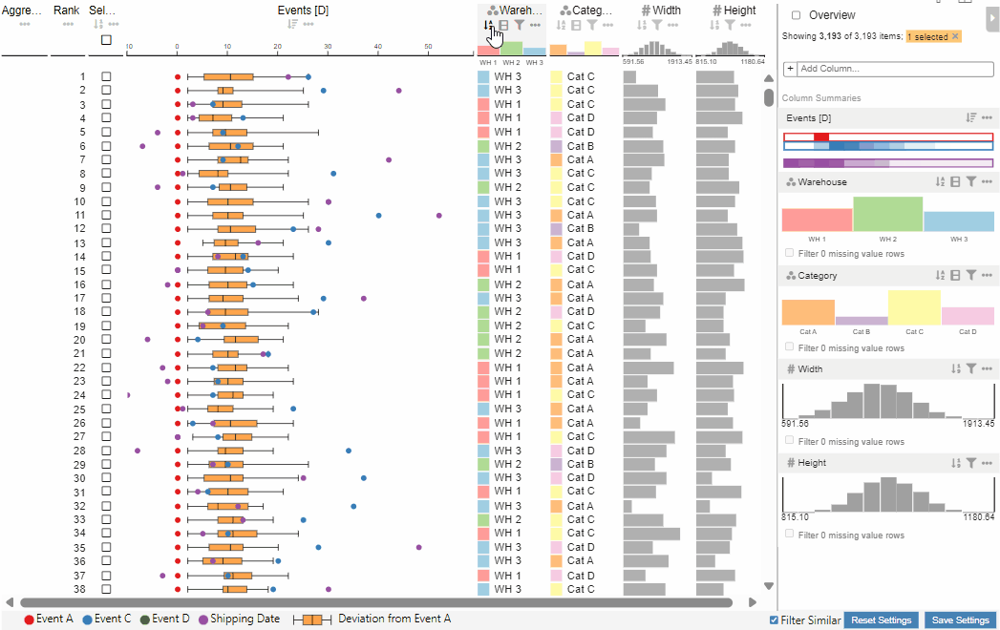

To add a second sorting column, hold the `CTRL` key while clicking on the sorting icon of the second column or select it in the data selection panel. The sorting order can be changed by clicking on the respective icon in the data selection panel.

### Sorting Groups

When grouping is enabled, the groups can be sorted by one or multiple columns. This can be enabled in the column settings for all data columns except the event column. After sorting the groups by one column, more columns can be added to the sorting hierarchy in the data selection panel.

### Sorting by Events

Since the event column has multiple events per row, the sorting event can be changed in the event column settings. Any event value and boxplot value can be used for sorting.

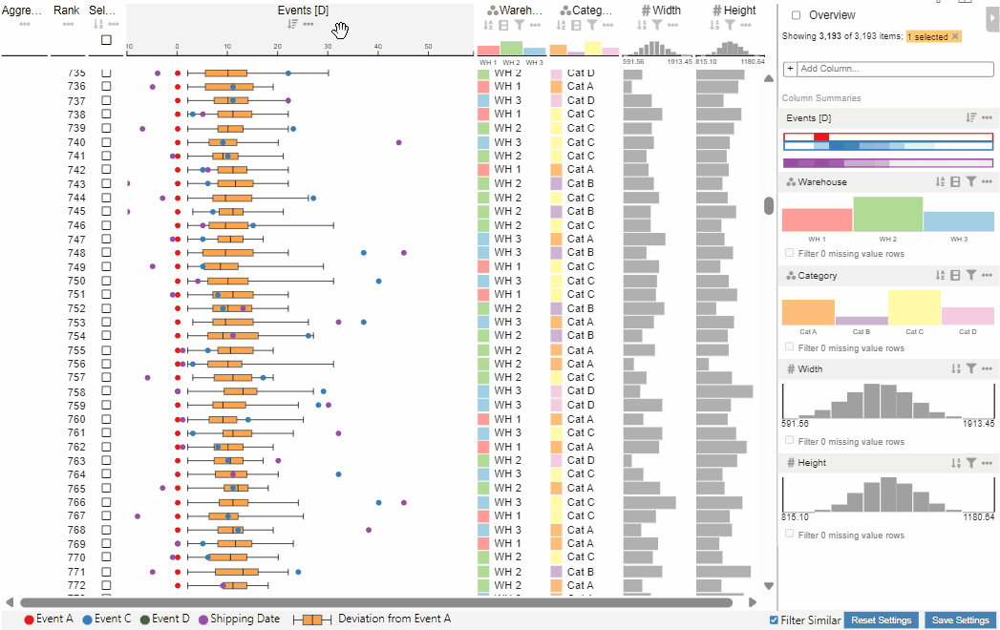

## Filtering

All columns except the event column can be filtered by clicking on the filter icon in the column header or by filtering in the data selection panel.

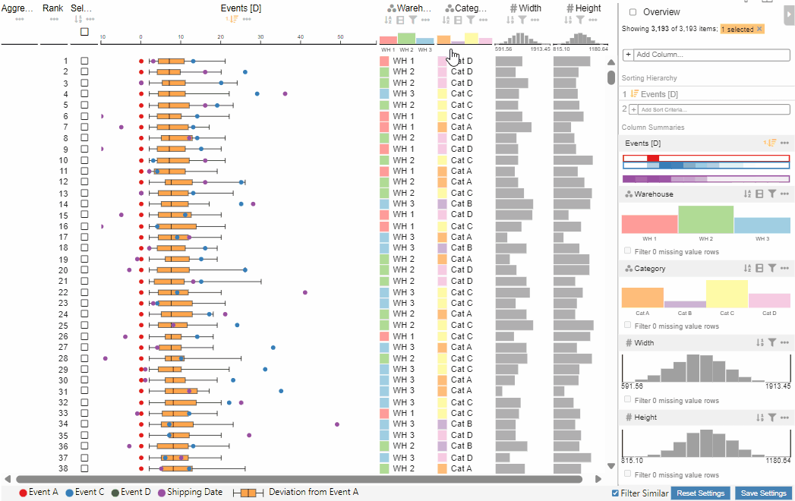

Categories can also be filtered by clicking on them. To reset a filter, click on the reset icon on the bottom left of the dialog.

## Overview Mode

The overview mode can be toggled in the data selection panel. It shows a compact view of the data where each row's height is reduced such that all rows are visible at once or the row height reaches one pixel. Selected rows are shown in full height.

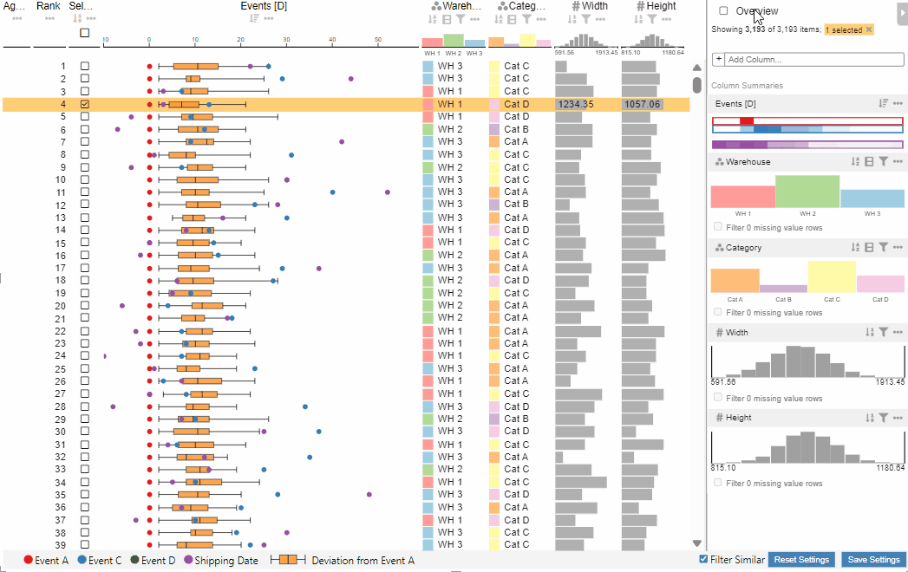

## Column Settings

Depending on the column type, different settings are available in the settings dialog when clicking on the 3 dots in the column header.

### Settings available for most columns

In addition to the previously mentiond grouping, sorting and filtering settings, the following settings are available for most columns:

#### Remove Column

All columns except the `Aggregate Groups` column can be removed in the settings.

#### Rename Column

Change the column title.

#### Color Mapping

The color mapping is dependant on the column type but available for all data columns.

For categorical columns and the event column the color can be changed individually for each category available in the column data or a predefined mapping can be automatically applied. The following image shows the mapping `Dark2` that has 8 colors available.

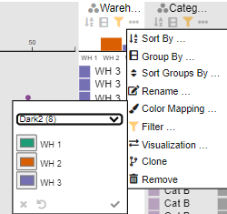

Numerical columns can be mapped to a solid color, sequential color scale, or diverging color scale. Predefined color scales are available and it is also possible to define a custom color scale.

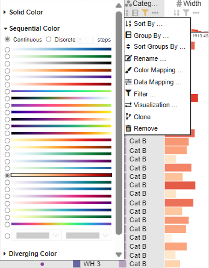

#### Visualizations

The visualization type of all data columns can be changed. The available visualizations depend on the column type.

The visualization type can be changed on different levels:

| Type    | Affected Parts                                                      |
| ------- | ------------------------------------------------------------------- |
| Item    | The visualization of the individual data rows in a cell             |
| Group   | The visualization in the group header                               |
| Summary | The visualization in the column header and the data selection panel |

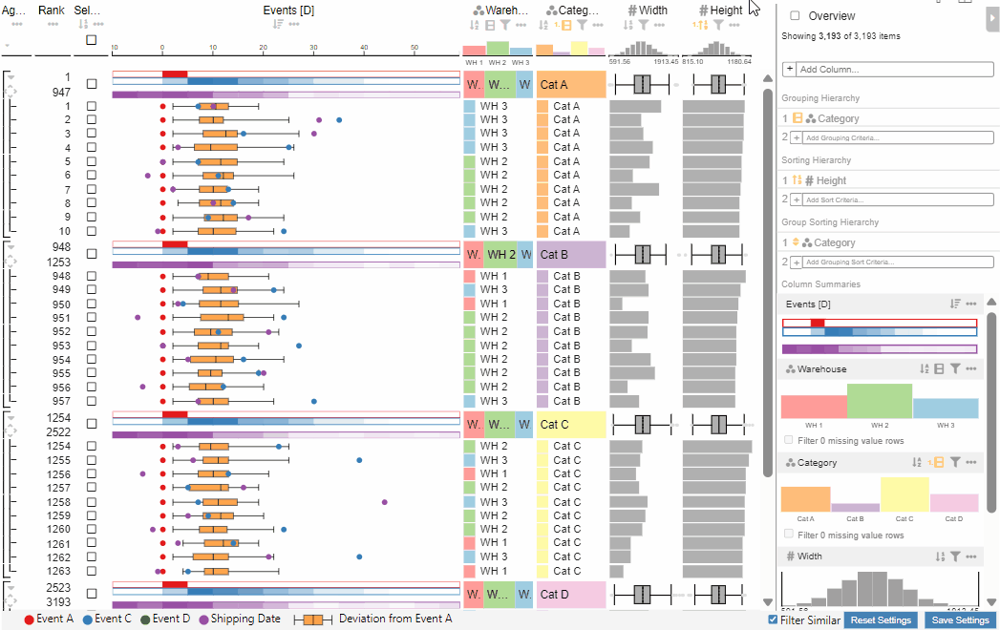

#### Clone

Cloning a column creates a new ranking visible next to the original ranking. In the data selection panel, a tab for each ranking is created. The different rankings allow comparison of different sorting, grouping, and filtering settings.

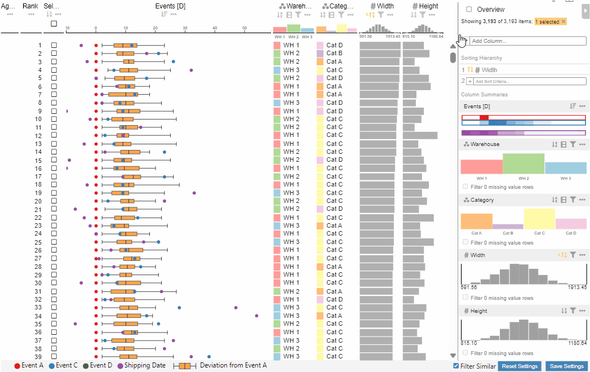

### Event Column Settings

The event column has the unique settings of selecting which events to display and setting the reference events.

#### Event Display Settings

The event display settings allow to select which events to display in normal mode and in overview mode. Since the boxplot cannot easily be displayed in the overview mode, its values (min, max, median, q1, q3) can be displayed instead. The default is to display the median. Other boxplot values have the same color but can be distinguished by their order.

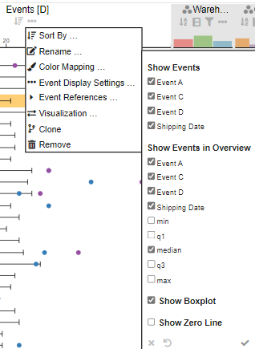

The boxplot can be hidden in the normal mode and there is a setting to show a zero line in the event column that can be useful when the reference event is the current date.

#### Event References

The event references allow to set a reference event for the time scale and the boxplot.

The reference event is subtracted from all other events which means that it is always at the center of the time scale. This allows to compare events that occured at different points in time and to view everything in relation to the reference event.

The boxplot reference event is used to calculate the boxplot values. All boxplot values are specified as a time offset and are then added to the specified reference event.

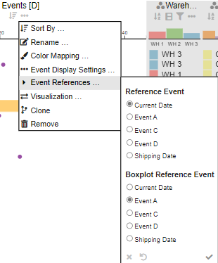

### Numerical Column Settings

The numerical column settings have a data mapping option that allows to specify a custom scaling function. For example the scaling can be changed from linear to logarithmic, absolute or square root. There is also an option to provide a custom mapping function.

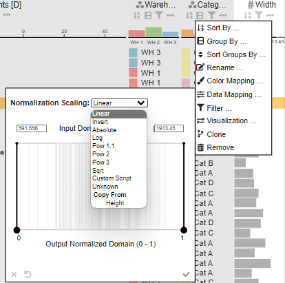

## Adding Columns

The button `Add Column` in the data selection panel allows to add new columns to the current ranking. It opens a dialog to add a new column, that can either be a column that is already loaded in the Power BI data model or a combined column.

### Weighted Sum

For example, the column `Weighted Sum` allows to combine multiple numerical columns into one column.

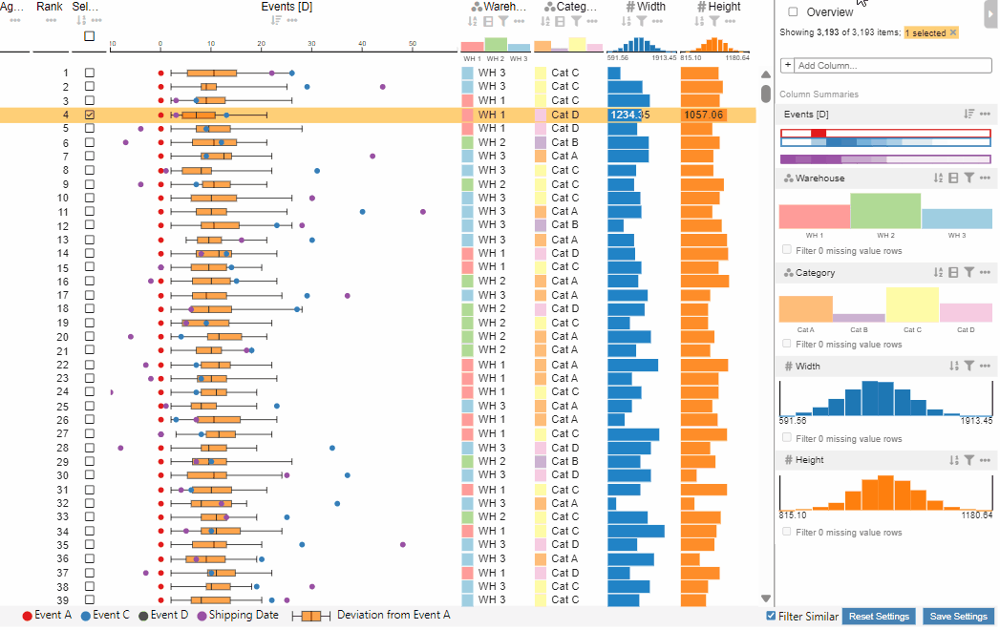

### Group Name

The column `Group Name` allows to view the amount of rows in a group and to sort by group name or group count.

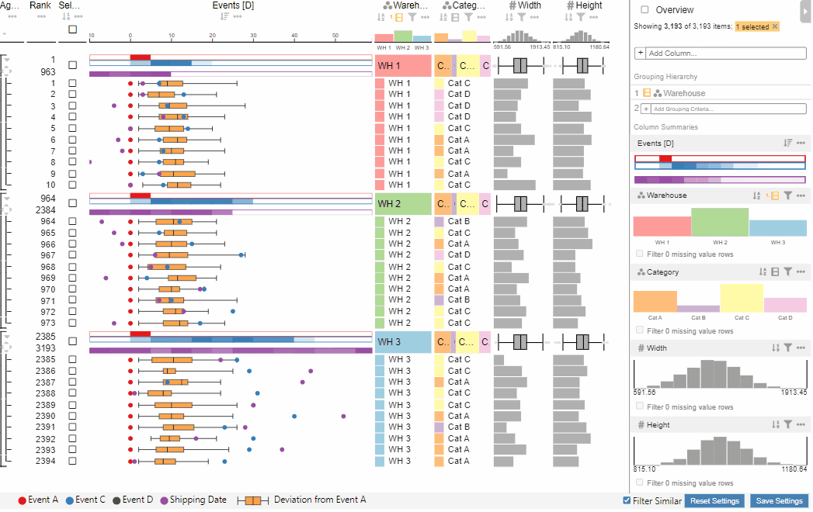
